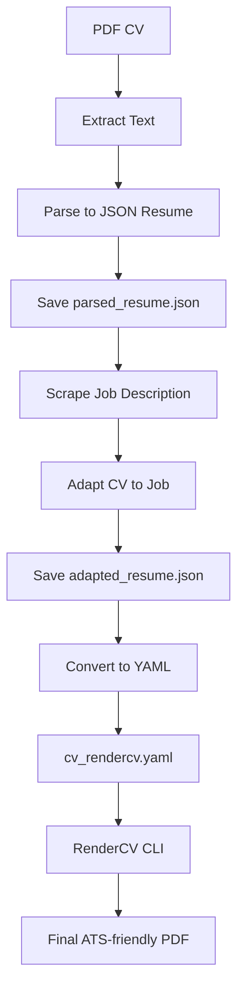

# CV Adapter - ATS Optimizer


---

## Description

**CV Adapter - ATS Optimizer** is an application that adapts and optimizes your resume (CV) to match a specific job description, maximizing your ATS (Applicant Tracking System) score. It uses artificial intelligence to analyze and rewrite your CV, highlighting the most relevant skills and keywords for each position.

---

## Key Features

- **PDF CV Upload**: Extracts and converts your CV to the JSON Resume standard.
- **Job Description Extraction**: Enter a URL or paste job text—the app automatically extracts key requirements.
- **Smart Analysis & Adaptation**: Compares skills, keywords, and experience between your CV and the job offer. Adapts your CV to maximize the match.
- **ATS Score Calculation**: Shows the compatibility percentage before and after optimization.
- **Output Generation**: Download your adapted CV as PDF, HTML, or YAML (RenderCV-ready).
- **Google Drive Integration**: Upload your adapted CV directly to your Google Drive.

---

## Installation

1. **Clone the repository:**
   ```bash
   git clone https://github.com/yourusername/CV_generator.git
   cd CV_generator
   ```
2. **Create and activate a virtual environment (optional):**
   ```bash
   python -m venv venv
   # On Unix/Mac
   source venv/bin/activate
   # On Windows
   venv\Scripts\activate
   ```
3. **Install dependencies:**
   ```bash
   pip install -r requirements.txt
   ```

---

## Quick Start

1. **Launch the app:**
   ```bash
   streamlit run app.py
   ```
2. **Follow the web interface steps:**
   - Upload your PDF CV.
   - Enter the job description URL or paste the text.
   - Click "Generate ATS-optimized CV".
   - Download your optimized CV or upload it to Google Drive.

---

## Workflow Diagram

This project converts a PDF CV into an ATS-optimized PDF tailored to a specific job description, following these steps:



---

## Project Structure

```
CV_generator/
├── app.py                   # Streamlit web interface
├── pipeline.py              # Main pipeline logic
├── src/                     # Processing modules
│   ├── cv_extraction.py
│   ├── cv_parser.py
│   ├── job_scraper.py
│   ├── job_to_cv_parser.py
│   ├── json_to_rendercv_yaml.py
│   ├── models.py
│   └── generate_cv.py
├── utils/                   # Utilities and helpers
│   └── utils.py
├── tests/                   # Unit tests
├── requirements.txt         # Dependencies
├── README.md                # This file
└── ...                      # Other files and outputs
```

---

## Environment Variables & Configuration

- To use LLM and Google Drive integration, set your secrets in Streamlit's `secrets.toml` file.
- Example:
  ```toml
  OPENROUTER_API_KEY = "your_openrouter_key"
  token_pickle_b64 = "..."
  client_secret_json = "..."
  ```

---

## Contributing

Contributions are welcome! Open an issue or pull request to suggest improvements, new features, or report bugs.

---

## License

This project is licensed under the MIT License. See the `LICENSE` file for details.

---

## Credits & Acknowledgements

- Inspired by best practices in CV and ATS optimization.
- Built with [Streamlit](https://streamlit.io/), [OpenAI](https://openai.com/), [RenderCV](https://github.com/mauriciogtec/rendercv), and other open-source libraries.

---
