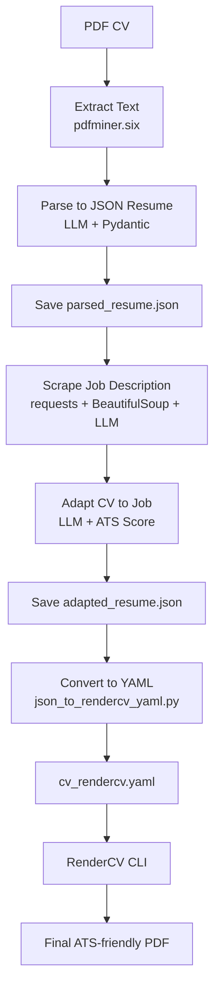

# CV Adapter (V1)

Converts a PDF CV to an ATS-friendly PDF using JSON Resume standard with LLM parsing.

---

## Setup (Windows)

1. Clone the repository or create the folder:

```
mkdir cv_adapter
cd cv_adapter
```

2. Install dependencies:

```
pip install -r requirements.txt
```

If `pip` fails, use:

```
py -m pip install -r requirements.txt
```

3. Place your CV as `input_cv.pdf` in the root folder.

4. Run the pipeline:

```
py src/main.py
```

---

## Project Structure

```
cv_adapter/
├── src/
│   ├── cv_extraction.py
│   ├── cv_parser.py
│   ├── ats_generator.py
│   └── main.py
├── tests/
│   ├── test_extraction.py
│   ├── test_parser.py
│   └── test_generator.py
├── input_cv.pdf
├── PLANNING.md
├── TASK.md
├── README.md
└── requirements.txt
```

---

## Description

- **Input:** PDF CV (`input_cv.pdf`)
- **Extraction:** Extracts text using `pdfminer.six`
- **Parsing:** Converts text to JSON Resume format via LLM
- **Output:** Generates ATS-friendly PDF using `reportlab`

---

## Future Versions

- V2: Job description adaptation, Streamlit UI
- V3: Interactive agent-based editing

---

### Workflow

This project converts a PDF CV into an ATS-optimized PDF tailored to a specific job description, following these steps:

1. **Extract CV Text**
   - Extracts plain text from the uploaded PDF using `pdfminer.six`.
   - Saves the raw text for debugging.

2. **Parse to JSON Resume**
   - Uses an LLM to convert the extracted text into a structured [JSON Resume](https://jsonresume.org/) format.
   - Validates the output with Pydantic models.

3. **Scrape Job Description**
   - Downloads and filters the job posting from a provided URL.
   - Uses an LLM to extract only the relevant job description content.

4. **Adapt CV to Job**
   - Compares the CV and job description to calculate an initial ATS compatibility score.
   - If the score is below 75%, uses an LLM to ethically optimize the CV by emphasizing relevant skills and keywords.
   - Recalculates the final ATS score.

5. **Convert to YAML**
   - Transforms the adapted JSON Resume into a YAML file compatible with RenderCV.

6. **Generate Final PDF**
   - Uses RenderCV CLI to generate a clean, ATS-friendly PDF ready for job applications.

---

### Workflow Diagram


